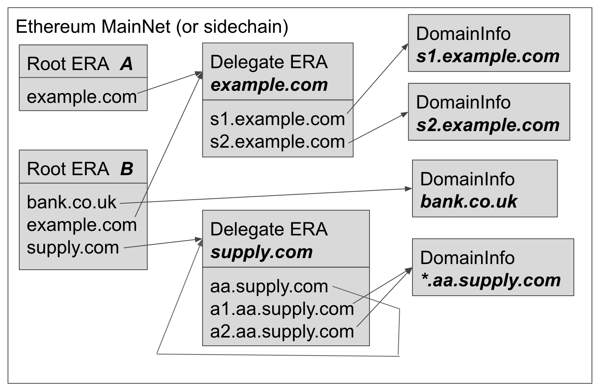

# Ethereum Registration Authority

Ethereum Registration Authorities (ERA) are entities which operate Ethereum
smart contracts which link 
organizations' blockchain identities to their domain names to their real world identities. 
ERAs need to complete a Know Your Customer (KYC) and optionally an Anti-Money Laundering 
(AML) audit for organizations prior to listing them. The initial usage is 
envisaged as to be used for bootstrapping sidechains for use in permissioned 
networks, however this technology could be used for any situation in which 
blockchain information needs to be tied to real world identities.  

When an organization wishes to establish a sidechain with one or more organizations, 
they consult root ERA contracts that they trust to gather the bootstrapping 
information for 
each organization which they wish to establish a private sidechain with. 

The diagram below shows an example of contracts used in the Ethereum Registration 
Authority system.

TODO An application, in the diagram shown as a Sidechain Client, needs to fetch 
information related to two domains: sc.example.com and bank.co.uk. It chooses 
two root ERAs which it trusts. It asks each if they have the address of information about 
the DomainInfo contracts for the domains sc.example.com and bank.co.uk. 
For sc.example.com, it asks if the the root ERAs have the parent 

domain example.com.

## Ethereum Registration Authority Contracts

ERAs are represented as smart contracts on the blockchain. The smart contract has the following features:
- Only the ERA organization can add and remove organizations from their list.
- Organisations can update their own information.

The map contains:
- Domain Name Message Digest: Kecak256 message digest of the domain name.
- Delegate ERA address: Address of an ERA which manages sub-domains below this domain name. If there is no such ERA, this value is zero.
- DomainInfo address: Address of DomainInfo contract. If there is no such DomainInfo for this domain name, then this is zero.
- Address of domain owner. This is 0 if the owner is the owner of the ERA contract.

The DomainInfo contract holds a map of key value pairs.

Keys are in a reverse domain names followed by organisation specific informaiton.

For example, for sidechains the following are defined:

tech.pegasys.scnode.size               The number of sidechain nodes.
tech.pegasys.scnode.1.enode        Sidechain node 1: enode.
tech.pegasys.scnode.1.enc            Sidechain node 1: encryption public key.

Key Format
* ----------
* keccak256(domain name, ":", key type)
*
* The domain name is the full domain name ("server1.example.com") or the special wild card domain ("*"). Keys which
* use the wild card provide default values for all domains in this Domain Information contract.
*
* Key type is either a value defined below or a user defined values. To avoid name collision, user defined keys
* should be prefixed using reverse domain name ordering for the domain which creates the key.
*
* Defined Keys             Expected Value and Value Format
* dns.a                    IPv4 address as described in RFC 1035: https://tools.ietf.org/html/rfc1035
* dns.aaaa                 IPv6 address as described in RFC 3596: https://tools.ietf.org/html/rfc3596
* dns.txt                  Text strings as described in RFC 1035: https://tools.ietf.org/html/rfc1035
* ef.enode                 Enode address in ASCII as described here: https://github.com/ethereum/wiki/wiki/enode-url-format
*
* tech.pegasys.sc.enc      Public encryption key / key agreement key for the Enterprise Ethereum node.
* tech.pegasys.sc.size     The maximum number of nodes in a sidechain cluster. Domain names for the cluster are expected
*                           to be named sc0.domain to sc(size-1).domain.
* tech.pegasys.contact.email Email address to use to contact the owner of the domain.
*
* Example Keys
* ------------
* keccak256(pegasys.tech:dns.a)                                 The IPv4 address for pegasys.tech.
* keccak256(*.sidechain.pegasys.tech:tech.pegasys.sc.size)      The maximum number of nodes in the sidechain cluster for sidechain.pegasys.tech.
* keccak256(sc3.sidechain.pegasys.tech:ef.enode)                The enode address of node sc3.sidechain.pegasys.tech.
* keccak256(*:tech.pegasys.contact.email)                       The email address to be used to contact the owner of the DomainInfo instance.